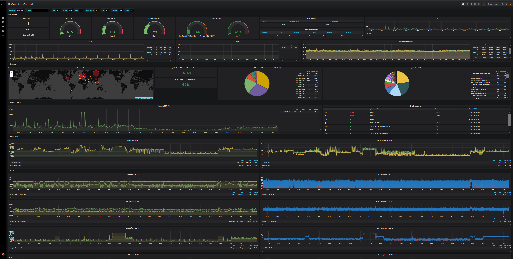

## What's Monitored
- Active Users
- Uptime
- CPU Load total
- Disk Utilization
- Memory Utilization
- CPU Utilization per core (Single Graph)
- Ram Utilization time graph
- Load Average
- Load Average Graph
- CPU and ACPI Temperature Sensors
- pfBlocker IP Stats
- pfBlocker DNS Stats
- Gateway Response time - dpinger
- List of interfaces with IPv4, IPv6, Subnet, MAC, Status and pfSense labels thanks to [/u/trumee](https://www.reddit.com/r/PFSENSE/comments/fsss8r/additional_grafana_dashboard/fmal0t6/)
- WAN Statistics - Traffic & Throughput (Identified by dashboard variable)
- LAN Statistics - Traffic & Throughput (Identified by dashboard variable)
- Unbound stats - Plugin and config included and working but not implemented



## Running on

    Grafana 7.4.3
    Influxdb 1.8.3
    
## Heads up!
In the recent commits I updated the telegraf config to use the [Tails Input Plugin](https://github.com/influxdata/telegraf/tree/master/plugins/inputs/tail) in place of the [Logparser Input Plugin](https://github.com/influxdata/telegraf/tree/master/plugins/inputs/logparser) since it's been deprecated.

I renamed many of the columns to reflect [what's being logged by pfBlockerNG-devel](https://github.com/pfsense/FreeBSD-ports/blob/232722ac52edaeede58b551e7e2efb690ce1023d/net/pfSense-pkg-pfBlockerNG-devel/files/usr/local/pkg/pfblockerng/pfblockerng.inc#L4597) and fixed some parsing bugs that cause lines to be skipped due to inconsistent log formatting.  As a result, the measurements ip_block_log and dnsbl_log have been replaced with tail_ip_block_log and tail_dnsbl_log respectively.

I dropped the old measurements

    bash-4.4# influx
    Connected to http://localhost:8086 version 1.8.3
    InfluxDB shell version: 1.8.3
    > auth
    username: admin
    password:
    > use pfsense
    Using database pfsense
    > drop measurement ip_block_log
    > drop measurement dnsbl_log

If you cannot live without this data, you could use the panels [from this commit](https://github.com/VictorRobellini/pfSense-Dashboard/blob/0df10172506242105891a81f5076019b5a5867b0/pfSense-Grafana-Dashboard.json) and not update the config. Read my note about the Logparser Input Plugin above!

If you want to load the complete logs files, you could probably change the telegraf config to:

from_beginning = false

to

from_beginning = true

I'm sure you can even rename the measurements, columns and update the tags, but that's beyond my influx capabilities.
    
### Templates of what I currently run in my Kubernetes homelab
Kubernetes deployed locally with [these instructions](https://www.reddit.com/r/homelab/comments/ipsc4r/howto_k8s_metallb_and_external_dns_access_for/)

Stripped [yaml templates](https://github.com/VictorRobellini/K8s-homelab-pub) used to deploy my homelab (including Influx and Grafana) are here


### docker-compose example with persistent storage
##### I've recently migrated my stack to Kubernetes, the image versions are updated but the docker-compose is untested.
```docker-compose

  grafana-pfSense:
    image: "grafana/grafana:7.4.3"
    container_name: grafana
    hostname: grafana
    mem_limit: 4gb
    ports:
      - "3000:3000"
    environment:
      TZ: "America/New_York"
      GF_INSTALL_PLUGINS: "grafana-clock-panel,grafana-simple-json-datasource,grafana-piechart-panel,grafana-worldmap-panel"
      GF_PATHS_DATA: "/var/lib/grafana"
      GF_DEFAULT_INSTANCE_NAME: "home"
      GF_ANALYTICS_REPORTING_ENABLED: "false"
      GF_SERVER_ENABLE_GZIP: "true"
      GF_SERVER_DOMAIN: "home.mydomain"
    volumes:
      - '/share/ContainerData/grafana:/var/lib/grafana'
    logging:
      driver: "json-file"
      options:
        max-size: "100M"
    network_mode: bridge

  influxdb-pfsense:
    image: "influxdb:1.8.3-alpine"
    container_name: influxdb
    hostname: influxdb
    mem_limit: 10gb
    ports:
      - "2003:2003"
      - "8086:8086"
    environment:
      TZ: "America/New_York"
      INFLUXDB_DATA_QUERY_LOG_ENABLED: "false"
      INFLUXDB_REPORTING_DISABLED: "true"
      INFLUXDB_HTTP_AUTH_ENABLED: "true"
      INFLUXDB_ADMIN_USER: "admin"
      INFLUXDB_ADMIN_PASSWORD: "adminpassword"
      INFLUXDB_USER: "pfsense"
      INFLUXDB_USER_PASSWORD: "pfsenseuserpassword"
      INFLUXDB_DB: "pfsense"
    volumes:
      - '/share/ContainerData/influxdb:/var/lib/influxdb'
    logging:
      driver: "json-file"
      options:
        max-size: "100M"
    network_mode: bridge
```
   
**Make sure you are using pfBlockerNG-devel**

## Configuration

### Grafana
The Config for the dashboard relies on the variables defined within the dashboard in Grafana.  When importing the dashboard, make sure to select your datasource. 

Dashboard Settings -> Variables

WAN - $WAN is a static variable defined so that a separate dashboard panel can be created for WAN interfaces stats.  Use a comma-separated list for multiple WAN interfaces.

LAN_Interfaces - $LAN_Interfaces uses a regex to remove any interfaces you don't want to be grouped as LAN. The filtering happens in the "Regex" field. I use a negative lookahead regex to match the interfaces I want excluded.  It should be pretty easy to understand what you need to do here. I have excluded igb0 (WAN) and igb1,igb2,igb3 (only used to host vlans).

After writing this up, I realize I need to change this variable name, it's just not going to happen right now. 

### Telegraf
[Telegraf Config](config/additional_config.conf)

In the [/config](config/additional_config.conf) directory you will find all of the additional telegraf config. In pfSense, under Services -> Telegraf, at the bottom of the page with the teeny tiny text box is where you paste in the included config.

I also included the config for Unbound DNS and it's commented out.  I'm not currently using it, but it's fully functional, just uncomment if you want to use it.

### Plugins
[Plugins](plugins)

I put all my plugins in /usr/local/bin and set them to 555


I also included a wrapper script for Unbound DNS.  I'm not currently using it, but it's fully functional.
   
## Troubleshooting

### Telegraf Plugins

- You can run most plugins from a shell/ssh session to verify the output. (the environment vars may be differet when telegraf is executing the plugin)
- If you're copying from a windows system, make sure the [CRLF is correct](https://www.cyberciti.biz/faq/howto-unix-linux-convert-dos-newlines-cr-lf-unix-text-format/)
- The below command should display unix line endings (\n or LF) as $ and Windows line endings (\r\n or CRLF) as ^M$.

`cat -e /usr/local/bin/telegraf_pfinterface.php`

#### Telegraf Troubleshooting
If you get no good output from running the plugin directly, try the following command before moving to the below step.

    # telegraf --test --config /usr/local/etc/telegraf.conf

To troubleshoot plugins further, add the following lines to the agent block in /usr/local/etc/telegraf.conf and send a HUP to the telegraf pid. You're going to need to do this from a ssh shell. One you update the config you are going to need to tell telegraf to read the new configs. If you restart telegraf from pfSense, this will not work since it will overwrite your changes.

#### Telegraf Config (Paste in to [agent] section)
    debug = true
    quiet = false
    logfile = "/var/log/telegraf/telegraf.log"

#### Restarting Telegraf
    # ps aux | grep '[t]elegraf.conf'
    # kill -HUP <pid of telegraf proces>

Now go read /var/log/telegraf/telegraf.log
    
### InfluxDB
When in doubt, run a few queries to see if the data you are looking for is being populated.

    bash-4.4# influx
    Connected to http://localhost:8086 version 1.8.3
    InfluxDB shell version: 1.8.3
    > auth
    username: admin
    password:
    > show databases
    name: databases
    name
    ----
    pfsense
    _internal
    > use pfsense
    Using database pfsense
    > show measurements
    name: measurements
    name
    ----
    cpu
    disk
    diskio
    gateways
    interface
    mem
    net
    netstat
    pf
    processes
    swap
    system
    tail_dnsbl_log
    tail_ip_block_log
    temperature
    > select * from system limit 20
    name: system
    time                host                     load1         load15        load5         n_cpus n_users uptime     uptime_format
    ----                ----                     -----         ------        -----         ------ ------- ------     -------------
    1585272640000000000 pfSense.home         0.0615234375  0.07861328125 0.0791015625  4      1       196870     2 days,  6:41
    1585272650000000000 pfSense.home         0.05126953125 0.07763671875 0.076171875   4      1       196880     2 days,  6:41
    1585272660000000000 pfSense.home         0.04296875    0.07666015625 0.0732421875  4      1       196890     2 days,  6:41
    1585272670000000000 pfSense.home         0.03564453125 0.07568359375 0.0703125     4      1       196900     2 days,  6:41
    1585272680000000000 pfSense.home         0.02978515625 0.07470703125 0.0673828125  4      1       196910     2 days,  6:41
    1585272690000000000 pfSense.home         0.02490234375 0.07373046875 0.064453125   4      1       196920     2 days,  6:42
    ...

## [Original Reddit thread](https://www.reddit.com/r/PFSENSE/comments/fsss8r/additional_grafana_dashboard/ "Originial Reddit thread")

I was going to post this in the thread made by [/u/seb6596](https://www.reddit.com/u/seb6596 "/u/seb6596") since this is based on [their dashboard](https://www.reddit.com/r/PFSENSE/comments/fsf7f7/my_pfsense_monitor_dashboard_in_grafana/ "their dashboard"), but I made quite a few changes and wanted to include information that would get lost in the thread.

What I updated:

- Created dashboard wide variables to make the dashboard more portable and easily configurable. You shouldn't need to update any of the queries.
- Took some inspiration and panels [from this dashboard](https://grafana.com/grafana/dashboards/9806 "from this dashboard")
- Included gateway RTT from dpinger thanks to [this integration](https://forum.netgate.com/topic/142093/can-telegraf-package-gather-latency-packet-loss-information/3 "this integration")
- Used[ telegraf configs](https://www.reddit.com/r/pfBlockerNG/comments/bu0ms0/pfblockerngtelegrafinfluxdb_ip_block_list/ " telegraf configs") from this post by [/u/PeskyWarrior](https://www.reddit.com/u/PeskyWarrior "/u/PeskyWarrior")
- Tag, templating - No need to specify all cpus or interfaces in the graph queries. These values are pulled in with queries.
- Added chart to show all adapters, IP, MAC and Status[ from here](https://github.com/influxdata/telegraf/issues/3756#issuecomment-485606025 " from here")
- Added Temperature data based on feedback from[ /u/tko1982](https://www.reddit.com/u/tko1982 " /u/tko1982") - CPU Temp and any other ACPI device that reports temp is now collected and reported

### TODO

- Include IP and ping methods from [/u/seb6596](https://www.reddit.com/u/seb6596 "/u/seb6596") when they are back online.
- Make it pretty. I've never been good at this part
- Get the RTT calculations right from the dpinger integration. It's in microseconds but for some reason doesn't match the graphs in pfSense when I compare them.
- Figure out if I can show subnet and media speed/duplex for the interfaces
- Use the pfSense labels in the graphs that show network stats - 2 different measurements
